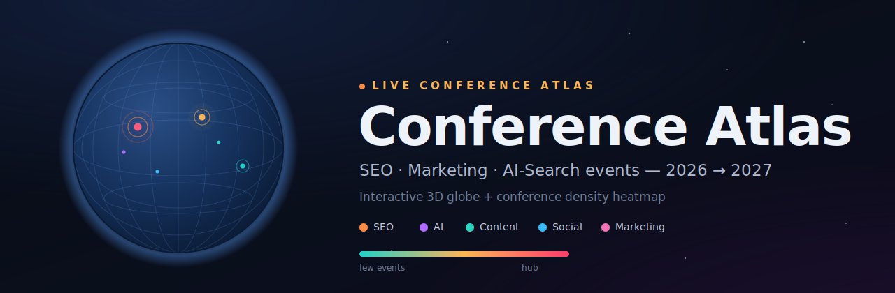

<!-- banner -->
<p align="center">
  
</p>

<h1 align="center">Conference Atlas — SEO &amp; Marketing Conferences on a 3D Globe (2026–2027)</h1>

<p align="center">
  An interactive, Google-Earth-style <strong>3D globe</strong> that maps the biggest <strong>SEO, marketing and AI-search conferences</strong> of the next 12 months — with a live <strong>density heatmap</strong> that shows where the industry actually gathers.
</p>

<p align="center">
  <a href="https://bogdankrupin.github.io/seo-conference-atlas/"><strong>🌍 Live demo</strong></a>
  &nbsp;·&nbsp;
  <a href="#-conferences-on-the-map">Conference list</a>
  &nbsp;·&nbsp;
  <a href="#-faq">FAQ</a>
</p>

<p align="center">
  
  
  
  
</p>

---

## ✨ What it is

**Conference Atlas** is a single-file web app for SEOs, marketers and event planners who want to *see* the conference calendar instead of scrolling a spreadsheet. The globe sits on the left; the chronological schedule sits on the right. Pick any event and the planet flies to its location and pulses over the host city — while a hex-bin heatmap reveals the real conference hubs of the search-marketing world.

It answers a practical question every marketing team asks each year: **which SEO and marketing conferences should we attend in 2026 and 2027, and where are they concentrated?**

## 🚀 Features

- **Interactive 3D globe** — realistic blue-marble Earth with topography, atmosphere glow and slow auto-rotation.
- **Click-to-fly** — select a conference and the camera animates to the city, drops a marker and emits pulsing rings.
- **Density heatmap** — events are aggregated into hexagonal bins; bin height and colour (teal → amber → hot pink) encode how many conferences cluster in each region.
- **Chronological schedule** — 31 real events from **Jul 2026 → Jun 2027**, colour-coded by focus (SEO, AI, Content, Social, Marketing, MarTech, GTM, Tech, Retail, Ecommerce).
- **Region filters** — slice the list by Americas / Europe / APAC.
- **Zero dependencies to install** — one `index.html`, libraries loaded from CDN. Drop it on any static host.
- **Responsive** — globe and list stack cleanly on mobile; respects `prefers-reduced-motion`.

## 🗺️ Where the industry clusters

The heatmap surfaces three dominant hubs:

| Region | Hotspots | Why it lights up |
| --- | --- | --- |
| **US East** | New York, Boston | NYC alone hosts MozCon, Pavilion GTM, NRF Big Show and SEO Week |
| **US West** | San Diego, San Francisco, Las Vegas, Anaheim, Palm Springs | BrightonSEO US, Ahrefs Evolve, Dreamforce, The AI Conference |
| **Western Europe** | London, Cologne, Munich, Amsterdam, Lisbon, Berlin | DMEXCO, SMX, WTSFest, friends of search, Web Summit |

APAC (Singapore, Sydney, Perth, Chiang Mai, Dubai) is the fastest-growing cluster but still trails the two anchor markets.

## 📅 Conferences on the map

Sorted by date. Dates marked with `*` are tentative — the 2027 editions are projected from previous years and not yet officially confirmed by organizers.

| # | Conference | Location | Date | Focus |
| --: | --- | --- | --- | --- |
| 1 | MozCon | New York, USA | Jul 14, 2026 | SEO |
| 2 | Digital Summit | Minneapolis, USA | Aug 2026 `*` | Marketing |
| 3 | State of Social | Perth, Australia | Aug 25–26, 2026 | Social |
| 4 | Hospitality Social Summit | London, UK | Sep 3–4, 2026 | Social |
| 5 | Dreamforce | San Francisco, USA | Sep 15–17, 2026 | MarTech |
| 6 | BrightonSEO US | San Diego, USA | Sep 15–16, 2026 | SEO |
| 7 | UNBOUND (INBOUND) | Boston, USA | Sep 16–18, 2026 | Marketing |
| 8 | DMEXCO | Cologne, Germany | Sep 23–24, 2026 | Digital |
| 9 | ANA AI for Marketers | Austin, USA | Sep 23–25, 2026 | AI |
| 10 | Pavilion GTM | New York, USA | Sep 28 – Oct 1, 2026 | GTM |
| 11 | The AI Conference | San Francisco, USA | Sep 29 – Oct 1, 2026 | AI |
| 12 | Content Marketing World | Denver, USA | Oct 5–7, 2026 | Content |
| 13 | Ahrefs Evolve | San Diego, USA | Oct 12–13, 2026 | SEO |
| 14 | MAICON | Cleveland, USA | Oct 13–15, 2026 | AI |
| 15 | ANA Masters of Marketing | Orlando, USA | Oct 20–23, 2026 | Marketing |
| 16 | Pubcon Pro | Las Vegas, USA | Q4 2026 `*` | SEO |
| 17 | DMWF Europe | Lisbon, Portugal | Nov 10–12, 2026 | Digital |
| 18 | Web Summit | Lisbon, Portugal | Nov 2026 `*` | Tech |
| 19 | Chiang Mai SEO Conference | Chiang Mai, Thailand | Nov 2026 `*` | SEO |
| 20 | Tech SEO Connect | Durham, USA | Dec 2026 `*` | SEO |
| 21 | NRF Big Show | New York, USA | Jan 2027 `*` | Retail |
| 22 | WTSFest | London, UK | Feb 2027 `*` | SEO |
| 23 | eTail West | Palm Springs, USA | Feb 22–25, 2027 | Ecommerce |
| 24 | SMX Munich | Munich, Germany | Mar 2027 `*` | SEO |
| 25 | Visi Summit | Dubai, UAE | Mar 2027 `*` | AI |
| 26 | friends of search | Amsterdam, Netherlands | Mar 2027 `*` | SEO |
| 27 | Sydney SEO Conference | Sydney, Australia | Mar 2027 `*` | SEO |
| 28 | SEO Week | New York, USA | Apr 2027 `*` | SEO |
| 29 | Social Media Marketing World | Anaheim, USA | Apr 2027 `*` | Social |
| 30 | Ahrefs Evolve Singapore | Singapore | May 2027 `*` | SEO |
| 31 | SMX Advanced | Berlin, Germany | Jun 2027 `*` | SEO |

## 🛠️ How it works

The app is intentionally a **single `index.html`** — no framework, no build step.

- **Rendering** — [three.js](https://threejs.org) via [globe.gl](https://github.com/vasturiano/globe.gl), loaded from CDN.
- **Earth** — blue-marble + topology bump textures from the `three-globe` example assets.
- **Heatmap** — `hexBinPointsData` aggregates conference coordinates into H3 hexagons; `sumWeight` drives both extrusion height and a custom teal→amber→pink colour ramp.
- **Markers & pulse** — a points layer for every event, plus a rings layer that animates outward from the selected city.
- **Data** — a plain `CONF` array near the top of the file (name, city, country, region, lat/lng, date, focus). Edit that array to add or update events; nothing else needs to change.

## ▶️ Run it locally

No tooling required:

```bash
# clone, then just open the file
git clone https://github.com/bogdankrupin/seo-conference-atlas.git
cd seo-conference-atlas
open index.html        # macOS  (use 'start index.html' on Windows)
```

An internet connection is needed the first time so the globe libraries and Earth textures can load from CDN.

## 🌐 Deploy on GitHub Pages

1. Push this repo (or fork it).
2. **Settings → Pages → Build and deployment → Source → Deploy from a branch.**
3. Branch **`main`**, folder **`/ (root)`** → **Save**.
4. Your atlas goes live at `https://<your-username>.github.io/seo-conference-atlas/` within ~1 minute.

Because the entry file is named `index.html`, Pages serves it straight from the root — no extra config.

## ➕ Add or edit a conference

Open `index.html`, find the `CONF` array, and add a row:

```js
{ n:"Your Event", city:"Berlin", country:"Germany", region:"Europe",
  lat:52.52, lng:13.405, d:"Sep 12–13, 2026", iso:"2026-09-12", tbc:false, cat:"SEO" }
```

- `region` must be one of `Americas` / `Europe` / `APAC` (matches the filter chips).
- `cat` drives the marker colour — `SEO`, `AI`, `Content`, `Social`, `Marketing`, `Digital`, `MarTech`, `GTM`, `Tech`, `Retail`, `Ecommerce`.
- `iso` is used only for sorting; `d` is the label shown to users.
- Set `tbc:true` for unconfirmed dates to show the *tentative* tag.

## ❓ FAQ

**What SEO conferences are happening in 2026?**
The 2026 line-up on the map includes MozCon (New York), BrightonSEO US (San Diego), Ahrefs Evolve (San Diego), DMEXCO (Cologne), Content Marketing World (Denver), Tech SEO Connect (Durham) and Chiang Mai SEO Conference, among others.

**Which marketing conferences are worth attending in 2027?**
Confirmed and projected 2027 events include eTail West (Palm Springs), SMX Munich, WTSFest (London), SEO Week (New York), Social Media Marketing World (Anaheim), Ahrefs Evolve Singapore and SMX Advanced (Berlin).

**Where are the biggest SEO conference hubs?**
New York, the US West Coast (San Diego / San Francisco) and Western Europe (London, Cologne, Munich, Lisbon) are the densest clusters — exactly what the heatmap highlights.

**Which conferences focus on AI search and GEO?**
The AI Conference, ANA AI for Marketers, MAICON and Visi Summit lean heavily into generative search, GEO/AEO and LLM visibility, with AI-search tracks now common at DMEXCO, SMX and Ahrefs Evolve too.

**Is it free and open source?**
Yes — MIT licensed. Fork it, reskin it, drop in your own event list, and host it anywhere static.

## 📄 Data &amp; accuracy

Conference details were compiled from public organizer announcements and industry calendars. Always confirm dates and venues on the official event site before booking — schedules shift, and 2027 editions (tagged *tentative*) are projected from prior years. Spotted something out of date? Open an issue or PR.

## 📝 License

[MIT](LICENSE) © Bogdan Krupin

---

<p align="center"><sub>Built for the search-marketing community. Star ⭐ the repo if it helped you plan your conference year.</sub></p>
